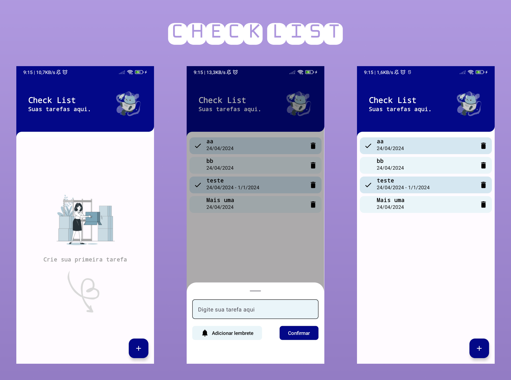

<h1 align="center">Check List Android</h1>

  
🗡️ CheckList é um app android, onde foi utilizado o Jetpack Compose, Hilt, Coroutines, Flow, Jetpack (Room, ViewModel), and Material Design based on MVVM architecture.

## Download
Acesse [Releases](https://github.com/Faguim02/CheckList-Android/blob/main/app/releases/app-debug.apk) para baixar o apk.
